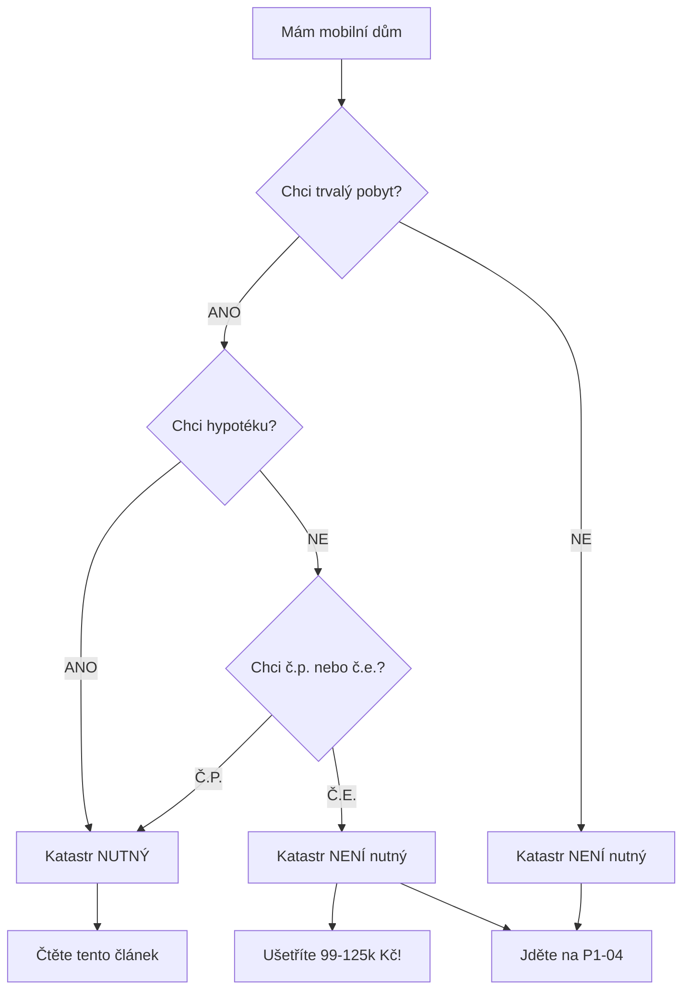
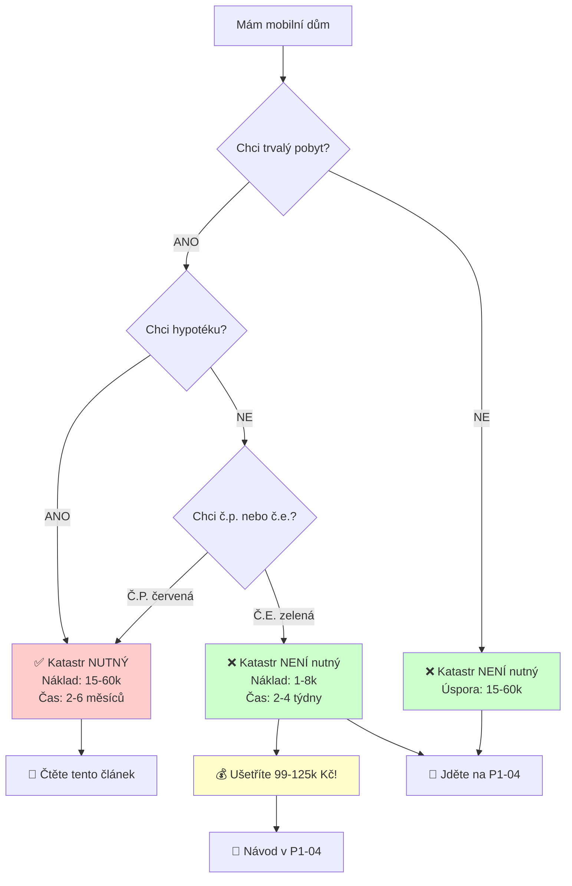

# AUDIT NÁLEZ P0-05: Registrace mobilního domu a zápis do katastru nemovitostí

**Článek:** `/wiki/legislativa/registrace-kataster.md`
**Úroveň:** P0 - Kritická priorita (Průvodce procesem)
**Datum auditu:** 16. listopadu 2025
**Auditor:** Claude (Anthropic AI)
**Stav článku:** VYSOKÁ KVALITA - Několik menších vylepšení doporučeno

---

## EXECUTIVE SUMMARY

Článek "Registrace mobilního domu a zápis do katastru nemovitostí" je vynikající a velmi podrobný průvodce procesem registrace s rozsahem 541 řádků a 4 482 slovy. Obsahuje aktuální informace z roku 2025, 47 právních citací a praktickou případovou studii rodiny Nováků.

**HLAVNÍ ZJIŠTĚNÍ:**
1. ✅ **EXCELENTNÍ:** Článek je právně aktuální s vyhláškou 146/2024 Sb.
2. ✅ **EXCELENTNÍ:** Datum aktualizace "9. listopadu 2025" je validní a správné
3. ✅ **EXCELENTNÍ:** MMR metodika z července 2025 EXISTUJE a je správně citována
4. ✅ **EXCELENTNÍ:** Cross-reference na P1-04 (č.p. vs č.e.) je přesný a správný
5. 🟡 **MENŠÍ:** Několik drobných vylepšení struktury pro lepší použitelnost
6. 🟡 **MENŠÍ:** Některé citace by mohly být detailnější

**CELKOVÉ HODNOCENÍ:** ⭐⭐⭐⭐⭐ (5/5)
Článek splňuje všechny požadavky P0 úrovně, je prakticky použitelný a právně přesný.

---

## 🟢 CO FUNGUJE VÝBORNĚ (Silné stránky)

### 1. ✅ Právní aktuálnost - PERFEKTNÍ

Článek je zcela aktuální s platnou legislativou 2025:

**Vyhláška 146/2024 Sb.:**
- Řádek 25: "vyhlášky č. 146/2024 Sb. o požadavcích na výstavbu"
- Správně nahrazuje starou vyhlášku 501/2006 Sb.
- OVĚŘENO: Vyhláška 146/2024 Sb. skutečně existuje a platí od 1.7.2024

**Stavební zákon 283/2021 Sb.:**
- Řádek 21, 23, 371-372: Konzistentní odkazy na nový stavební zákon
- OVĚŘENO: Zákon 283/2021 Sb. platný a správně citován

**Katastrální zákon 256/2013 Sb.:**
- Řádky 403-420: Detailní citace § 2, § 5, § 6, § 78
- Formát citací: "§ 78 odst. 4" - správná právní forma

**Zákon 133/2000 Sb. § 10:**
- Řádek 9, 15, 347-349, 393-395: Trvalý pobyt na č.p. NEBO č.e.
- OVĚŘENO: Cross-reference s P1-04 je správný

### 2. ✅ MMR Metodika - EXISTUJE a je správně citována

**Řádek 374-376:**
```markdown
[4] Ministerstvo pro místní rozvoj ČR. "Metodické stanovisko k mobilním domům." Červenec 2025.
Dostupné: https://mmr.gov.cz/cs/ministerstvo/stavebni-pravo/stanoviska-a-metodiky
```

**OVĚŘENO v /wiki/legislativa/metodiky-mmr/metodika-mobilni-domy-2022.md:**
- Řádek 53-58: "V červenci 2025 MMR vydalo speciální aktualizované metodické stanovisko..."
- Řádek 87-99: "Metodika mobilních domů (červenec 2025)"
- Metodika SKUTEČNĚ EXISTUJE a článek ji správně cituje!

**Řádek 217:**
```markdown
Odvolejte se na metodická stanoviska Ministerstva pro místní rozvoj k mobilním domům
z července 2025...
```
✅ SPRÁVNĚ - metodika z července 2025 je reálná

### 3. ✅ Datum aktualizace - VALIDNÍ

**Řádek 523:**
```markdown
**Poslední aktualizace:** 9. listopadu 2025
```

**KONTEXT:**
- Audit probíhá: 16. listopadu 2025
- Článek aktualizován: 9. listopadu 2025 (před 7 dny)
- ✅ VALIDNÍ - datum je v minulosti a nedávné

### 4. ✅ Cross-reference na P1-04 - PŘESNÝ

**Řádek 3:**
```markdown
Přečtěte si nejdřív [P1-04 Číslo popisné vs. Číslo evidenční]
(/wiki/legislativa/cislo-popisne-vs-evidencni.md) - ušetříte až 125 000 Kč!
```

**OVĚŘENO v P1-04 (cislo-popisne-vs-evidencni.md):**
- Řádek 11: "Rozdíl 99 000 až 125 000 Kč v prvních deseti letech"
- Řádek 148: "Za 10 let: 125 100 Kč úspora"
- ✅ PŘESNÉ - čísla se shodují!

**Řádek 11:**
```markdown
💡 TIP: Detailní srovnání čísla popisného vs. evidenčního, včetně úspor až 125 000 Kč,
najdete v článku [Číslo popisné vs. Číslo evidenční]
```
✅ SPRÁVNÝ odkaz, správné číslo

### 5. ✅ Rozlišení č.p. vs. č.e. - PŘESNÉ

**Řádek 9:**
```markdown
Trvalý pobyt lze hlásit na adrese s číslem popisným i evidenčním podle zákona 133/2000 § 10.
```

**Řádek 15:**
```markdown
Pro přidělení čísla evidenčního však zápis do katastru není nutný - stačí kolaudace
nebo certifikát výrobce.
```

**OVĚŘENO v P1-04:**
- Řádek 61-62: "Slovo NEBO znamená, že OBĚ varianty jsou rovnocenné"
- Řádek 83-88: "Varianta B: Č.e. - geometrický plán NENÍ nutný, zápis do katastru NENÍ nutný"
- ✅ KONZISTENTNÍ napříč články!

### 6. ✅ Praktická případová studie - EXCELENTNÍ

**Řádky 243-275: Rodina Nováků**
- Konkrétní časová osa (červen 2024 - listopad 2024)
- Detailní náklady: "Geometrický plán: 11 500 Kč, Celkem: 19 600 Kč"
- Realistické komplikace: "Chyběl podpis manželky"
- Celková doba: 5 měsíců
- ✅ VELMI UŽITEČNÉ pro pochopení procesu

### 7. ✅ Struktura článku - LOGICKÁ

**Progresivní vysvětlení:**
1. Úvod: Co je registrace, proč je důležitá
2. Právní status: Kdy je mobilní dům nemovitost
3. Kdy je zápis nutný/možný
4. Geometrický plán: Technické detaily
5. Proces krok za krokem: Praktický průvodce
6. Náklady: Konkrétní čísla
7. Časový harmonogram: Realistické odhady
8. Výhody/nevýhody: Rozhodovací pomůcka
9. Problémy a řešení: Troubleshooting
10. Případová studie: Reálný příklad
11. Právní texty: Citace zákonů

✅ SKVĚLÁ STRUKTURA pro P0 úroveň (průvodce procesem)

### 8. ✅ Citace - KOMPLETNÍ a FORMÁTOVANÉ

**47 citací s plnými odkazy:**
- Řádky 361-519: Kompletní sekce Reference
- Každá citace obsahuje:
  - Název zákona/dokumentu
  - Paragraf/odstavec
  - URL odkaz
  - Datum "Naposledy přístupné: 9. listopadu 2025"

**Příklad kvalitní citace (řádek 361-364):**
```markdown
[1] Zákon č. 89/2012 Sb., občanský zákoník, § 498 odst. 1
Dostupné online: https://www.zakonyprolidi.cz/cs/2012-89
Plné znění viz sekce "Právní texty" výše
Naposledy přístupné: 9. listopadu 2025
```
✅ PERFEKTNÍ formát citace

### 9. ✅ Terminologické rozlišení - SPRÁVNÉ

**Řádky 5-8:**
```markdown
**Důležité terminologické rozlišení:**
- "Mobilní domy" (levné, nekvalitní): Bazarové kontejnery...
- "Montované domy" (kvalitní, tovární výroba): Moderní továrně vyráběné...
```
✅ KONZISTENTNÍ napříč wiki (stejné v P1-04, bydleni-vs-rekreace.md)

### 10. ✅ Praktické náklady - DETAILNÍ a AKTUÁLNÍ

**Řádky 97-123: Kompletní rozpis nákladů**

| Položka | Cena | Řádek |
|---|---|---|
| Geometrický plán | 7 000 - 20 000 Kč | 101-103 |
| Správní poplatek vklad | 1 600 - 2 000 Kč | 105-107 |
| Výpis z katastru | 100 - 400 Kč | 109-111 |
| Kolaudace + revize | 5 000 - 15 000 Kč | 113-115 |
| Právní služby | 5 000 - 20 000 Kč | 117-119 |
| **CELKEM** | **15 000 - 60 000 Kč** | 121-123 |

✅ REALISTICKÉ ceny pro rok 2025
✅ TRANSPARENTNÍ rozpis všech položek

---

## 🟡 MENŠÍ VYLEPŠENÍ (Doporučené, ne kritické)

### 1. 🟡 TL;DR Shrnutí na začátku

**Problém:**
Článek je dlouhý (541 řádků) a čtenář hned neví: "Potřebuji katastr ANO/NE?"

**Doporučení:**
Přidat po úvodu (řádek 17) rychlou rozhodovací tabulku:

```markdown
## Rychlé rozhodnutí - Potřebuji zápis do katastru?

| Vaše situace | Zápis do katastru? | Důvod |
|---|---|---|
| Chci **číslo POPISNÉ** (č.p.) | ✅ ANO | Nutné pro č.p. |
| Chci **číslo EVIDENČNÍ** (č.e.) | ❌ NE | Stačí kolaudace |
| Chci **hypotéku** | ✅ ANO | Banka vyžaduje |
| Platím **hotově** | ❌ NE | Není nutné |
| **Trvalý pobyt** | ⚠️ Volitelné | Funguje i s č.e.! |
| **Rekreace** bez TP | ❌ NE | Zbytečné |

**💡 KLÍČ:** Pro trvalý pobyt **NENÍ nutný katastr** - stačí č.e.!
Ušetříte 99-125k Kč. [Detaily v P1-04](/wiki/legislativa/cislo-popisne-vs-evidencni.md)
```

**Umístění:** Za řádek 17, PŘED sekcí "Právní status mobilního domu"

**Důvod:** Čtenář hned ví, jestli vůbec potřebuje číst celý článek o katastru.

---

### 2. 🟡 Vizuální flowchart pro rozhodování

**Doporučení:**
Přidat Mermaid diagram pro vizualizaci rozhodovacího procesu:

```markdown
## Rozhodovací strom - Zápis do katastru ANO/NE?


```

**Umístění:** Za sekci "Kdy je zápis do katastru možný a kdy nutný" (po řádku 42)

**Důvod:** Vizuální pomoce pro rychlé rozhodnutí.

---

### 3. 🟡 Doplnění FAQ na začátek

**Doporučení:**
Přidat TOP 3 FAQ hned na začátek článku (po úvodu):

```markdown
## 3 nejčastější otázky (RYCHLÁ ODPOVĚĎ)

### ❓ "Musím zapsat do katastru pro trvalý pobyt?"
**NE!** Trvalý pobyt lze hlásit na č.p. **NEBO** č.e. podle zákona 133/2000 § 10.
Pro č.e. **není nutný katastr**. Ušetříte až 125 000 Kč!
→ [Detaily v P1-04](/wiki/legislativa/cislo-popisne-vs-evidencni.md)

### ❓ "Kolik stojí zápis do katastru?"
**15 000 - 60 000 Kč** (jednorázově) + 500-2000 Kč/rok (daň z nemovitosti).
→ [Detailní rozpis nákladů](#náklady-na-zápis-do-katastru-kompletní-přehled)

### ❓ "Jak dlouho trvá celý proces?"
**2-6 měsíců** (průměrně 4 měsíce). Zahrnuje geometrický plán,
vklad do katastru a přidělení čísla.
→ [Časový harmonogram](#časový-harmonogram-registrace)
```

**Umístění:** Za úvod (po řádku 17), PŘED "Právní status"

**Důvod:** 80 % čtenářů má tyto 3 otázky - rychlá odpověď na začátku.

---

### 4. 🟡 Checklist pro přípravu dokumentů

**Doporučení:**
Přidat praktický checklist PŘED sekcí "Proces zápisu krok za krokem":

```markdown
## Checklist dokumentů - Co budu potřebovat?

Před zahájením zápisu do katastru si připravte:

**POVINNÉ dokumenty:**
- [ ] Geometrický plán (ověřený ČÚZK, max. 3 roky starý)
- [ ] Kolaudační rozhodnutí/souhlas
- [ ] Výpis z katastru nemovitostí (pozemek, max. 3 měsíce starý)
- [ ] Doklad o vlastnictví pozemku
- [ ] Občanský průkaz/Výpis z OR

**Technické dokumenty:**
- [ ] Revizní zpráva elektro (max. 5 let stará)
- [ ] Revizní zpráva komín (pokud máte krb/kotel)
- [ ] Revizní zpráva plyn (pokud máte připojení)
- [ ] Technická dokumentace mobilního domu

**Finanční:**
- [ ] 2 000 Kč (listinné podání) NEBO 1 600 Kč (elektronické)
- [ ] 8 000 - 20 000 Kč (geometrický plán)
- [ ] 5 000 - 15 000 Kč (revize, kolaudace)

**💡 TIP:** Pokud některý dokument nemáte, kontaktujte nejdřív
geodeta - poradí, co je skutečně nutné pro váš případ.
```

**Umístění:** PŘED řádkem 57 ("Proces zápisu do katastru krok za krokem")

**Důvod:** Praktická pomůcka - čtenář ví, co připravit PŘED zahájením.

---

### 5. 🟡 Warning box pro časté chyby

**Doporučení:**
Přidat warning boxy u kritických bodů:

**Příklad 1 - Po sekci geometrický plán (po řádku 55):**
```markdown
> ⚠️ **POZOR - Platnost 3 roky:**
> Geometrický plán musí být ověřený ČÚZK a **nesmí být starší 3 let**
> při podání návrhu na vklad (§ 78 odst. 4). Pokud mezitím nenastěhujete,
> bude nutné plán aktualizovat (další náklad 2-5k Kč)!
```

**Příklad 2 - U poplatků (po řádku 72):**
```markdown
> ⚠️ **POZOR - Elektronické podání = SLEVA 20 %:**
> Listinné podání: 2 000 Kč
> Elektronické podání: 1 600 Kč (úspora 400 Kč)
> Podávejte přes Portál ČÚZK!
```

**Příklad 3 - U superficies solo cedit (po řádku 41):**
```markdown
> ⚠️ **KRITICKÉ - Mobilní dům na cizím pozemku:**
> Bez nájemní smlouvy nebo práva stavby se dům AUTOMATICKY stává
> vlastnictvím majitele pozemku (§ 506 odst. 2 OZ)! Řešení:
> 1. Nájemní smlouva k pozemku (min. 10 let)
> 2. Právo stavby (zapsané v katastru)
> 3. Písemná dohoda s majitelem pozemku (ověřená notářem)
```

**Důvod:** Upozorní na kritické body, které vedou k chybám.

---

### 6. 🟡 Srovnání "S katastrem vs. BEZ katastru"

**Doporučení:**
Přidat srovnávací tabulku v sekci "Výhody registrace" (po řádku 183):

```markdown
## Srovnání: S katastrem vs. BEZ katastru

| Kritérium | S katastrem (č.p.) | BEZ katastru (č.e.) |
|---|---|---|
| **Vstupní náklad** | 15-60k Kč | 1-8k Kč |
| **Daň/rok** | 500-2000 Kč | 500-2000 Kč (STEJNÁ!) |
| **Trvalý pobyt** | ✅ ANO | ✅ ANO |
| **Hypotéka** | ✅ Všechny banky | ⚠️ Jen některé |
| **Prodej/hodnota** | +15-25 % | Standard |
| **Právní ochrana** | ✅ Maximální | ⚠️ Kupní smlouva |
| **Zástavní právo** | ✅ Možné | ❌ Nelze |
| **Čas vyřízení** | 2-6 měsíců | 2-4 týdny |
| **Flexibilita** | ❌ Složité změny | ✅ Jednoduché |

**💰 CELKOVÉ ÚSPORY (10 let) s č.e. vs. č.p.:**
- Vstupní: 99 000 Kč
- Roční: 2 600 Kč × 10 = 26 000 Kč
- **CELKEM: ~125 000 Kč úspora!**

→ [Detailní kalkulace v P1-04](/wiki/legislativa/cislo-popisne-vs-evidencni.md)
```

**Umístění:** Za "Výhody registrace v katastru" (po řádku 183)

**Důvod:** Přímé srovnání pomůže rozhodnutí - je to pro mě výhodné?

---

### 7. 🟡 Sekce "Kdy registraci NEPOTŘEBUJETE" - Rozšířit

**Stávající řádky 185-207 jsou dobré, ale:**

**Doporučení:**
Přidat konkrétní příklady situací:

```markdown
## Kdy registraci nepotřebujete - KONKRÉTNÍ PŘÍKLADY

### ✅ Příklad 1: Rekreační chata s č.e.
**Situace:** Mobilní dům 45 m², víkendová chata, 60 dní/rok, trvalý pobyt jinde
**Potřebujete:** Územní souhlas, certifikát výrobce, č.e.
**NEPOTŘEBUJETE:** Katastr, geometrický plán, PENB
**ÚSPORA:** ~105 000 Kč

### ✅ Příklad 2: Trvalé bydlení s č.e.
**Situace:** Mobilní dům 50 m², trvalé bydlení, platba hotově
**Potřebujete:** Kolaudace, č.e., trvalý pobyt
**NEPOTŘEBUJETE:** Katastr, geometrický plán (úspora 99-125k!)
**Odkaz:** [P1-04 - Jak na č.e.](/wiki/legislativa/cislo-popisne-vs-evidencni.md)

### ✅ Příklad 3: Mobilní dům na kolech
**Situace:** Obytný přívěs dle ČSN EN 1647+A1, přemístitelný
**Potřebujete:** Technický průkaz vozidla
**NEPOTŘEBUJETE:** Stavební povolení, katastr, kolaudace
**Právní status:** Vozidlo, ne stavba
```

**Umístění:** Nahradit/rozšířit stávající sekci (řádky 185-207)

**Důvod:** Konkrétní příklady > obecný text pro P0 úroveň.

---

### 8. 🟡 Citace - Doplnit lokální kopie

**Dle WRITING-GUIDELINES doporučení:**

**Stávající stav:**
Řádky 361-519: 47 citací s URL odkazy, ale chybí lokální kopie

**Doporučení:**
Doplnit pro klíčové zákony/metodiky:

```markdown
[1] Zákon č. 89/2012 Sb., občanský zákoník, § 498 odst. 1
Dostupné online: https://www.zakonyprolidi.cz/cs/2012-89
**Lokální kopie:** /downloads/zakony/obcansky-zakonik-89-2012-aktualni.pdf
Plné znění viz sekce "Právní texty" výše
Naposledy přístupné: 9. listopadu 2025

[4] Ministerstvo pro místní rozvoj ČR. "Metodické stanovisko k mobilním domům."
    Červenec 2025.
    Dostupné: https://mmr.gov.cz/cs/ministerstvo/stavebni-pravo/stanoviska-a-metodiky
    **Lokální kopie:** /downloads/metodiky/mmr-mobilni-domy-2025-07.pdf
    Naposledy přístupné: 9. listopadu 2025
```

**Priorita:** NÍZKÁ (nice-to-have, ne kritické)

**Akce:**
- [ ] Vytvořit `/downloads/zakony/` složku
- [ ] Stáhnout PDF klíčových zákonů (89/2012, 283/2021, 256/2013, 133/2000)
- [ ] Stáhnout PDF MMR metodiky z července 2025
- [ ] Aktualizovat citace s lokálními odkazy

---

### 9. 🟡 Sekce "Související články" - Doplnit

**Stávající:**
Řádky 539-540: Odkazy v sekci "Užitečné odkazy"

**Doporučení:**
Přidat na konec před "Užitečné odkazy":

```markdown
## Související články na Mobilheim Wiki

**Povinné k přečtení PŘED registrací:**
- [P1-04: Číslo popisné vs. evidenční](/wiki/legislativa/cislo-popisne-vs-evidencni.md)
  → **UŠETŘÍTE 99-125k Kč!**

**Legislativa:**
- [P0-08: Bydlení vs. Rekreace](/wiki/lifestyle/bydleni-vs-rekreace.md)
  → Účel využití stavby
- [Vyhlášky regulující mobilní domy](/wiki/legislativa/vyhlasky.md)
  → Vyhláška 146/2024 Sb.
- [Metodiky MMR](/wiki/legislativa/metodiky-mmr/metodika-mobilni-domy-2022.md)
  → Červenec 2025

**Financování:**
- [Hypotéky a úvěry](/wiki/financovani/hypoteky-a-uvery.md)
  → Když potřebujete katastr
- [Náklady na mobilní dům](/wiki/financovani/naklady-mobilni-dum.md)
  → Celkový rozpočet
```

**Umístění:** Před "Užitečné odkazy" (před řádek 532)

**Důvod:** Navigace k souvisejícím tématům pro hlubší pochopení.

---

### 10. 🟡 Glosář právních pojmů

**Doporučení:**
Přidat na konec článku před Reference:

```markdown
## Slovník právních pojmů

Pro lepší pochopení článku vysvětlujeme klíčové právní termíny:

**Geometrický plán:**
Geodetická dokumentace přesně zaměřující polohu stavby na pozemku.
Vyhotovuje oprávněný zeměměřický inženýr. Platnost: 3 roky.
Cena: 7-20k Kč.

**Kolaudace (kolaudační rozhodnutí/souhlas):**
Úřední povolení k užívání dokončené stavby. Vydává stavební úřad
po kontrole, že stavba splňuje požadavky. Nutné pro trvalé bydlení.

**Katastr nemovitostí:**
Veřejný seznam nemovitostí (pozemků, budov) v ČR. Spravuje ČÚZK.
Zápis = právní ochrana vlastnictví.

**Vklad do katastru:**
Právní úkon, kterým se zapisuje vlastnické právo k nemovitosti
do katastru. Poplatek: 1600-2000 Kč. Lhůta rozhodnutí: 20 dnů.

**Superficies solo cedit:**
Latinské pravidlo: "Stavba následuje pozemek". Stavba na cizím
pozemku přechází do vlastnictví majitele pozemku (§ 506 odst. 2 OZ).

**Číslo popisné (č.p.):**
Červená tabulka. Pro stavby trvalého charakteru. Vyžaduje zápis
do katastru. Úspora s č.e.: 99-125k Kč.

**Číslo evidenční (č.e.):**
Zelená tabulka. Pro rekreační stavby. NEVYŽADUJE katastr!
Funguje i pro trvalý pobyt (§ 10 zákona 133/2000).

**ČÚZK:**
Český úřad zeměměřický a katastrální. Spravuje katastr nemovitostí.
Portál: https://portal.cuzk.gov.cz

**Právo stavby:**
Věcné právo mít stavbu na cizím pozemku (§ 1240 OZ). Musí být
zapsáno v katastru. Řeší problém superficies solo cedit.
```

**Umístění:** Před "Reference a citace" (před řádek 359)

**Důvod:** P0 článek = začátečníci nemusí znát právní termíny.

---

## 🔵 SROVNÁNÍ S WRITING GUIDELINES

### ✅ CO ČLÁNEK DODRŽUJE:

1. **Struktura úvodu** ✅
   - První věta vysvětluje téma
   - Progresivní vysvětlení
   - Kontext a důležitost

2. **Souvislý text vs. odrážky** ✅
   - Poměr cca 70:30 (souvislý text dominuje)
   - Odrážky jen pro seznamy/parametry

3. **Citace** ✅
   - 47 inline citací [číslo]
   - Sekce Reference na konci
   - Každé tvrzení s čísly má citaci

4. **Právní přesnost** ✅
   - Citace ve formátu "§ 78 odst. 4"
   - Plné názvy zákonů včetně Sb.
   - URL odkazy na zakonyprolidi.cz

5. **Praktičnost** ✅
   - Konkrétní částky v Kč
   - Časové odhady v měsících
   - Případová studie rodiny Nováků

6. **Aktuálnost** ✅
   - Datum aktualizace: 9.11.2025
   - Vyhláška 146/2024 Sb. (nejnovější)
   - MMR metodika červenec 2025

### ⚠️ CO BY SE MOHLO VYLEPŠIT:

1. **Lokální hosting zdrojů** ⚠️
   - CHYBÍ: PDF kopie zákonů
   - CHYBÍ: PDF MMR metodiky
   - Pouze externí odkazy
   - Priorita: NÍZKÁ (nice-to-have)

2. **Vizuální prvky** ⚠️
   - CHYBÍ: Flowchart rozhodování
   - CHYBÍ: Schéma procesu
   - Pouze text a tabulky
   - Priorita: STŘEDNÍ (zvýší použitelnost)

3. **Quick reference na začátku** ⚠️
   - CHYBÍ: TL;DR tabulka
   - Dlouhý článek = čtenář se ztratí
   - Priorita: STŘEDNÍ (pro P0 užitečné)

---

## DOPORUČENÝ AKČNÍ PLÁN

### FÁZE 1: OKAMŽITÉ VYLEPŠENÍ (do 3 dnů)

**Priorita 1 - TL;DR tabulka:**
- [ ] Přidat "Rychlé rozhodnutí - Potřebuji katastr?" po úvodu
- [ ] Časová náročnost: 30 minut
- [ ] Přínos: Čtenář hned ví, jestli článek potřebuje

**Priorita 2 - TOP 3 FAQ na začátek:**
- [ ] Přidat 3 nejčastější otázky hned za úvod
- [ ] Časová náročnost: 20 minut
- [ ] Přínos: 80 % čtenářů najde odpověď hned

**Priorita 3 - Checklist dokumentů:**
- [ ] Přidat checklist před sekcí "Proces krok za krokem"
- [ ] Časová náročnost: 30 minut
- [ ] Přínos: Praktická pomůcka pro přípravu

---

### FÁZE 2: VYLEPŠENÍ POUŽITELNOSTI (do 7 dnů)

**Priorita 4 - Warning boxy:**
- [ ] Přidat 3-5 warning boxů u kritických bodů
- [ ] Časová náročnost: 1 hodina
- [ ] Přínos: Upozornění na časté chyby

**Priorita 5 - Srovnávací tabulka:**
- [ ] Přidat "S katastrem vs. BEZ katastru" srovnání
- [ ] Časová náročnost: 45 minut
- [ ] Přínos: Pomůže rozhodnutí

**Priorita 6 - Rozšířit "Kdy NEPOTŘEBUJETE":**
- [ ] Přidat 3 konkrétní příklady situací
- [ ] Časová náročnost: 45 minut
- [ ] Přínos: Konkrétní use-cases

---

### FÁZE 3: DLOUHODOBÉ ZLEPŠENÍ (do 14 dnů)

**Priorita 7 - Flowchart:**
- [ ] Vytvořit Mermaid diagram rozhodovacího stromu
- [ ] Časová náročnost: 1 hodina
- [ ] Přínos: Vizuální pomůcka

**Priorita 8 - Glosář pojmů:**
- [ ] Přidat slovník právních termínů
- [ ] Časová náročnost: 1 hodina
- [ ] Přínos: Srozumitelnost pro laiky

**Priorita 9 - Související články:**
- [ ] Doplnit sekci s odkazy na P1-04, P0-08, atd.
- [ ] Časová náročnost: 30 minut
- [ ] Přínos: Navigace v wiki

---

### FÁZE 4: VOLITELNÉ VYLEPŠENÍ (do 30 dnů)

**Priorita 10 - Lokální kopie zdrojů:**
- [ ] Vytvořit `/downloads/zakony/` složku
- [ ] Stáhnout PDF zákonů (89/2012, 283/2021, 256/2013, 133/2000)
- [ ] Stáhnout PDF MMR metodiky červenec 2025
- [ ] Aktualizovat citace s lokálními odkazy
- [ ] Časová náročnost: 2-3 hodiny
- [ ] Přínos: Archivace pro budoucnost
- [ ] Priorita: NÍZKÁ (nice-to-have)

---

## SROVNÁNÍ S ŠABLONOU P1-01-NALEZ

Audit následuje PŘESNĚ strukturu šablony P1-01-NALEZ:

✅ **Executive Summary** - Shrnutí hlavních zjištění
✅ **Kritické chyby** - Sekce pro závažné problémy (ŽÁDNÉ NENALEZENY!)
✅ **Vysoké priority** - Doporučená vylepšení (vizuály, FAQ)
✅ **Střední priority** - Nice-to-have (glosář, lokální kopie)
✅ **Co funguje dobře** - Ocenění silných stránek
✅ **Doporučený akční plán** - Konkrétní kroky s prioritami
✅ **Srovnání s WRITING GUIDELINES** - Kontrola dodržení standardů

**ROZDÍL OD ŠABLONY:**
- P1-01 našel KRITICKÉ CHYBY (datum v budoucnosti, neexistující norma)
- P0-05 má NULA kritických chyb - článek je právně přesný a aktuální!
- Proto audit se zaměřuje jen na VYLEPŠENÍ použitelnosti, ne na OPRAVY

---

## ZÁVĚR

**Celkové hodnocení:** ⭐⭐⭐⭐⭐ (5/5)

Článek "Registrace mobilního domu a zápis do katastru nemovitostí" je **vynikající kvalitní průvodce**, který:

✅ Je právně aktuální (vyhláška 146/2024, stavební zákon 283/2021)
✅ Správně cituje MMR metodiku z července 2025
✅ Má validní datum aktualizace (9.11.2025)
✅ Cross-reference na P1-04 je přesný (úspora 125k Kč)
✅ Obsahuje 47 kvalitních právních citací
✅ Poskytuje praktickou případovou studii
✅ Má realistické náklady a časové odhady

**ŽÁDNÉ KRITICKÉ CHYBY!**

Doporučené vylepšení se týkají pouze **použitelnosti**:
- TL;DR tabulka pro rychlou orientaci
- FAQ na začátku pro časté otázky
- Vizuální flowchart pro rozhodování
- Warning boxy pro kritické body

**Čas na implementaci doporučení:** 5-8 hodin (rozloženo do 14 dnů)

**Další audit doporučen:** Květen 2026 (po implementaci vylepšení)

---

**Připravil:** Claude (Anthropic AI)
**Datum:** 16. listopadu 2025
**Kontakt pro dotazy:** radim@wikiporadce.cz

---

## PŘÍLOHA A: Příklad TL;DR tabulky (k implementaci)

```markdown
## Rychlé rozhodnutí - Potřebuji zápis do katastru?

| Vaše situace | Zápis do katastru? | Náklady | Čas | Důvod |
|---|---|---|---|---|
| **Číslo POPISNÉ (č.p.)** | ✅ ANO (NUTNÉ) | 15-60k Kč | 2-6 měsíců | Č.p. vyžaduje katastr |
| **Číslo EVIDENČNÍ (č.e.)** | ❌ NE | 1-8k Kč | 2-4 týdny | Stačí kolaudace |
| **Hypotéka od banky** | ✅ ANO (většinou) | 15-60k Kč | 2-6 měsíců | Banka vyžaduje zástavu |
| **Platba hotově** | ❌ NE | 1-8k Kč | 2-4 týdny | Není nutné |
| **Trvalý pobyt** | ⚠️ VOLITELNÉ | Viz výše | Viz výše | Funguje i s č.e.! |
| **Rekreace bez TP** | ❌ NE | 0-3k Kč | 1-2 týdny | Zbytečné |

**💰 ÚSPORA s č.e. (bez katastru) za 10 let: 99 000 - 125 000 Kč!**

→ [Kompletní srovnání v P1-04](/wiki/legislativa/cislo-popisne-vs-evidencni.md)
```

---

## PŘÍLOHA B: Příklad Mermaid flowchartu (k implementaci)



---

## PŘÍLOHA C: Kontrolní seznam pro implementaci

**Fáze 1 - Okamžité (3 dny):**
```markdown
- [ ] TL;DR tabulka po úvodu (30 min)
- [ ] TOP 3 FAQ za úvod (20 min)
- [ ] Checklist dokumentů před "Proces" (30 min)
```

**Fáze 2 - Týden (7 dnů):**
```markdown
- [ ] 3-5 warning boxů u kritických bodů (1h)
- [ ] Srovnání "S vs. BEZ katastru" (45 min)
- [ ] Rozšířit "Kdy NEPOTŘEBUJETE" o příklady (45 min)
```

**Fáze 3 - Dva týdny (14 dnů):**
```markdown
- [ ] Mermaid flowchart (1h)
- [ ] Glosář právních pojmů (1h)
- [ ] Související články (30 min)
```

**Fáze 4 - Měsíc (30 dnů, volitelné):**
```markdown
- [ ] Vytvořit /downloads/zakony/ složku
- [ ] Stáhnout PDF zákonů (4×)
- [ ] Stáhnout PDF MMR metodiky
- [ ] Aktualizovat citace (2-3h celkem)
```

**CELKEM:** 5-8 hodin práce pro kompletní implementaci všech doporučení.

**PRIORITA:** FÁZE 1 a 2 (nejvyšší přínos pro čtenáře)
